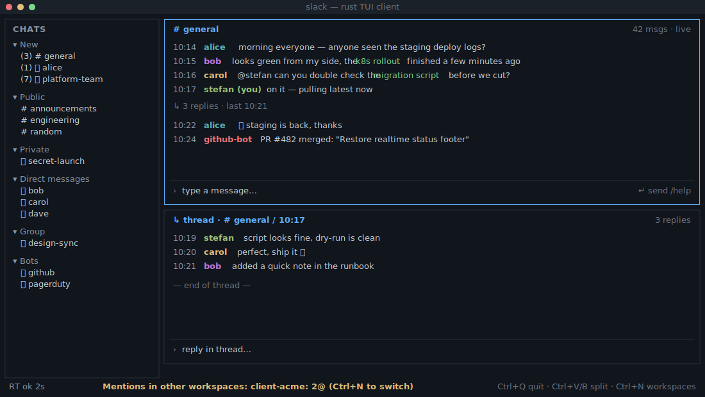

# shlack

[](https://www.rust-lang.org/)
[](https://ratatui.rs)
[](https://stevoo.net/shlack/)

terminal-native slack client built with rust and [ratatui](https://ratatui.rs).
multi-workspace, multi-pane, real-time via socket mode, with inline image previews via the
kitty graphics protocol. lightweight: ~11 MB RAM and well under 1% CPU at idle.



```
== features ==

multi-workspace   configure + switch many workspaces; Ctrl+1..9 quick switch;
                  Ctrl+N or /workspace to list; per-workspace state; auto-migrates
                  old single-workspace configs

split / panes     split vertical (Ctrl+V) or horizontal (Ctrl+B); per-pane focus,
                  scroll, input; mouse focus; toggle direction (Ctrl+K), close
                  (Ctrl+W), clear (Ctrl+L); collapsible sidebar (Ctrl+S)

real-time         live updates across panes via socket mode; typing indicators;
                  desktop notifications; auto-refresh; threads in panes (/thread,/t)

channel list      "new" section for unread on top; public / private / group / dm /
                  bots sections; unread badges + red highlight; arrows + enter

display           emoji rendering (Ctrl+O), reactions (Ctrl+E, /react), timestamps
                  (Ctrl+T), line numbers (Ctrl+G), compact (Ctrl+D), colour-coded
                  usernames (Ctrl+U), borderless (Ctrl+Y), mouse (Ctrl+M), [img]/
                  [video] markers, inline kitty image preview (Ctrl+P, lazy + cached)

persistence       layout/splits, open chats, display settings, aliases
                  (~/.config/shlack/aliases.json), per-pane scroll

extras            filter by sender/media/link, @-mention tab completion, multi-line
                  input (Shift+Enter), reply context, forwarded messages, user cache
```

```
== prerequisites ==

- rust 1.70+ (rustup recommended)

- a terminal with 256+ colours. inline image previews need the kitty graphics protocol
  (kitty, wezterm, ghostty, or an iterm2-compatible terminal). without it, image messages
  still show the [img] marker and /media #N works.

- a slack app with socket mode enabled:
  - app-level token with connections:write scope (xapp-...)
  - user oauth token (xoxp-...) or bot user oauth token (xoxb-...); either is accepted,
    user tokens usually have wider channel/dm access
```

```
== slack app setup ==

1. api.slack.com/apps -> create or select an app

2. settings -> socket mode -> enable

3. generate an app-level token with connections:write

4. oauth & permissions -> add scopes:
   channels:history channels:read chat:write groups:history groups:read
   im:history im:read mpim:history mpim:read reactions:write users:read
   (no extra file scopes: /media uses file urls from message metadata)

5. features -> event subscriptions -> enable events, subscribe to:
   message.channels message.groups message.im message.mpim  (edits/deletes included)
   user_typing (optional, typing indicators).  socket mode needs no request url.

6. reinstall the app to the workspace after adding events

7. copy the bot/user token + app token
```

```bash
# quick start
git clone <repo> shlack
cd shlack
cargo build --release          # or ./build.sh
./target/release/shlack
```

first run prompts for workspace name, bot token (xoxb-) or user token (xoxp-), and app
token (xapp-). add more workspaces by editing the config or rerunning setup. config lives
in ~/.config/shlack/: slack_config.json (workspaces/tokens/settings),
layout.json (panes + open channels), aliases.json (text aliases).

```
== navigation ==

Tab            switch channel-list <-> panes, or cycle panes
Up/Down        navigate list, or move cursor (scroll when input empty)
PageUp/PageDn  scroll messages faster (10 lines)
Home/End       start/end of input line · Ctrl+Home/End oldest/newest message
Left/Right     move cursor in input · Del/Backspace delete fwd/back
Enter          open selected channel / send · Shift+Enter newline · Esc cancel/clear
workspace      Ctrl+N list · Ctrl+1..9 switch · Ctrl+R refresh list · Ctrl+Q quit (saves)
```

```
== commands ==

/react <emoji> [msg#]    add reaction (no #: last message). names without colons.
/thread <msg#>  (/t)     open a message thread in a new pane
/filter [sender|media|link] [value]   filter pane; /filter alone clears
/alias <name> <value>    text expansion · /unalias <name> removes
/workspace [name|num] (/ws)   switch / list workspaces
/media #XX               download + open media from message #XX
/leave                   leave the current channel (closes the pane)
/help  (/h)              show help
```

```
== config file format ==

slack_config.json holds multiple workspaces and settings; old single-workspace configs
are converted automatically:

{
  "workspaces": [
    { "name": "My Company",  "token": "xoxp-...", "app_token": "xapp-..." },
    { "name": "Side Project","token": "xoxp-...", "app_token": "xapp-..." }
  ],
  "active_workspace": 0,
  "settings": { "show_reactions": true, "show_notifications": true,
    "compact_mode": false, "show_emojis": true, "show_line_numbers": false,
    "show_timestamps": true, "show_chat_list": true, "show_user_colors": true,
    "show_borders": true, "mouse_support": true, "show_image_preview": true }
}
```

```text
== project layout ==

src/
  main.rs         entry point + event loop
  app.rs          core application + ui rendering
  slack.rs        slack api (http + socket mode)
  widgets.rs      chat pane data structures
  split_view.rs   layout tree for pane splitting
  commands.rs     command parsing + handlers
  formatting.rs   message text formatting
  persistence.rs  state saving/loading
  config.rs       configuration management
  utils.rs        utility functions (notifications, etc.)
```

```
== troubleshooting ==

connection      verify tokens in slack_config.json; socket mode enabled; oauth scopes ok

no messages     Ctrl+R to refresh; app added to private channels; channels:history +
                groups:history scopes present

shortcuts       ensure the terminal passes Ctrl combos through; try short forms (/h)

display         bigger terminal for multi-pane; Ctrl+D compact; Ctrl+S hide list

image preview   needs a kitty-graphics terminal; on probe failure it logs and falls back
                to [img]; toggle Ctrl+P (persisted as show_image_preview); /media #N
                downloads to ./store/ and opens with the os default app
```

contributions welcome (more formatting, filters, search, dm group management, file upload,
themes). open source.
